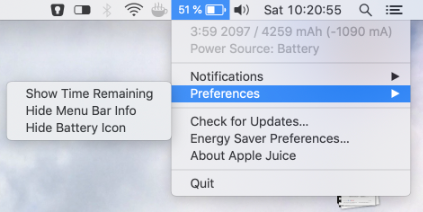
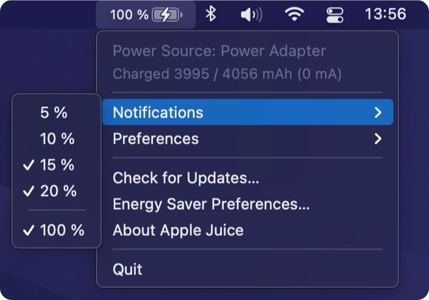
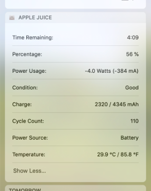
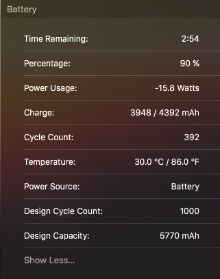

# Apple Juice #
An advanced battery gauge for OS X. *Apple Juice* can show you the estimated time remaining, right within the status bar and notifies you about certain percentages, if you want.

__Today Widget__

Get even more information about your current battery status, without cluttering your screen, with the *Apple Juice Today Widget*. Just take a quick glance at your battery’s stats, whenever you want.

### Ok, but how accurate is it? ###
Probably as accurate as it gets. The information come directly from OS X’s IO registry and are updated constantly. Although the estimated remaining time differs from time to time in comparison to Apple’s battery gauge (for about +/- 15mins.). I guess Apple uses another algorithm for calculating the remaining time, but I can’t tell which is more accurate. At least it’s still an *estimated* time.

## How do I install it? ##
You have two options:
1. Download the [latest binary](https://github.com/raphaelhanneken/apple-juice/releases/latest) and drop it into your `Applications folder`*.
2. Download the source code and build it yourself, with Xcode. You'll also need to install [Carthage](https://github.com/Carthage/Carthage), if you haven’t done so already, and run `carthage update` from your Terminal. Otherwise Xcode won't find the [Sparkle Framework](https://github.com/sparkle-project/Sparkle), since I haven’t put it under version control. 

*Since I don’t have an Apple Developer account, you have to allow third party apps within the system preferences.
 `System Preferences: Security & Privacy: Allow apps downloaded from: Anywhere`.

## How do I contribute? ##
You can fork this project, make your changes and send me a pull request. Just make sure you fork the latest development version and that [SwiftLint](https://github.com/realm/SwiftLint) succeeds. Or, since the whole source code is licensed under the MIT License, fork *Apple Juice* and make your own thing.

__________

### License ###
The MIT License (MIT)

Copyright (c) 2015 Raphael Hanneken

Permission is hereby granted, free of charge, to any person obtaining a copy of this software and associated documentation files (the "Software"), to deal in the Software without restriction, including without limitation the rights to use, copy, modify, merge, publish, distribute, sublicense, and/or sell copies of the Software, and to permit persons to whom the Software is furnished to do so, subject to the following conditions:

The above copyright notice and this permission notice shall be included in all copies or substantial portions of the Software.

THE SOFTWARE IS PROVIDED "AS IS", WITHOUT WARRANTY OF ANY KIND, EXPRESS OR IMPLIED, INCLUDING BUT NOT LIMITED TO THE WARRANTIES OF MERCHANTABILITY, FITNESS FOR A PARTICULAR PURPOSE AND NONINFRINGEMENT. IN NO EVENT SHALL THE AUTHORS OR COPYRIGHT HOLDERS BE LIABLE FOR ANY CLAIM, DAMAGES OR OTHER LIABILITY, WHETHER IN AN ACTION OF CONTRACT, TORT OR OTHERWISE, ARISING FROM, OUT OF OR IN CONNECTION WITH THE SOFTWARE OR THE USE OR OTHER DEALINGS IN THE SOFTWARE.
